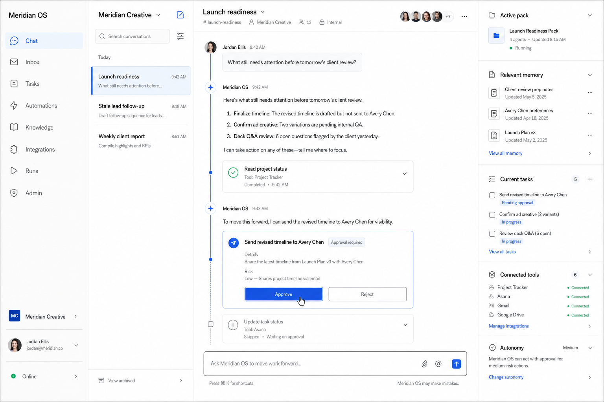
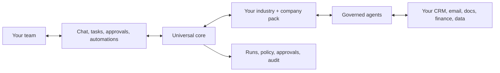

# AI Native Operating System

An AI-native operating system gives a company one shared place to ask what is happening, move work forward, approve sensitive actions, and automate the routine handoffs between its existing tools. It does not replace the tools or the team. It gives both a governed coordination layer with memory, ownership, repeatable procedures, and a record of what happened.

This repository is a working reference implementation by Stephen Bickel. It runs with a deterministic fictional company and no third-party secrets, then connects to a team's own database, model account, tools, Vercel account, or local infrastructure.



## The engine is universal. The way your business runs is the customization.

`core/` defines the reusable operating contract: memory, skills, governance, tasks, integrations, automation, and audit behavior. `packs/` applies an industry's language, restrictions, procedures, tools, and safe seed structure without changing the engine.



The hard rule is simple: nothing company- or industry-specific belongs in `core/`. Packs may tighten permissions; they may never weaken the baseline.

## See it running: Meridian Creative

The full marketing-agency pack brings a fictional 12-person agency to life.

| Before | With the operating system |
|---|---|
| Leads wait in a CRM queue | A weekday workflow finds stale leads, drafts the next step, pauses for send approval, and reconciles the CRM |
| Project status lives in meetings | Chat assembles the current answer from tasks, plans, decisions, and tool records with evidence links |
| Weekly reporting consumes senior time | A skill drafts the client pulse, separates facts from inference, cites each metric, and asks the account owner to approve |
| Client preferences live in one person's head | Reviewed one-fact memories make preferences usable and auditable without hiding them in a prompt |
| Automations are opaque | Every step, retry, approval, tool effect, and failure is visible in the shared run history |

The demo includes six agency skills, six least-privilege tool contracts, 15 reviewed facts, four realistic journals, in-flight work, mock connectors, and two deterministic automations.

## Chat first, not chat only

The Next.js workspace includes Chat, Inbox, Tasks, Automations, Knowledge, Integrations, Runs, and Admin. A conversation can become durable work; a long-running process survives the browser; an external action becomes a readable approval card; and every team member works inside the same customer-owned workspace.

## Built for different risk profiles

The law-firm pack is matter-scoped and makes conflict disposition, privilege, confidentiality, legal review, and human sending enforceable gates. The healthcare-practice pack keeps PHI in designated systems, retrieves only minimum-necessary fields, prohibits clinical decisions, and requires humans to send every external communication.

Regulated work is handled by stricter autonomy tiers, operation allowlists, access boundaries, durable approvals, and immutable audit records—not by bolting a disclaimer onto an unrestricted agent.

## Run it

Requirements: Node.js 22+, pnpm 11+, and optionally Docker.

```bash
cp .env.example .env.local
pnpm install
pnpm --filter @anos/web dev
```

Open `http://localhost:3000/workspace/meridian-demo`. Mock mode is the default and needs no model or tool key.

Run the deterministic automation demo and repository contracts:

```bash
make demo
make validate
```

For a customer-owned deployment, see [local](docs/deployment/LOCAL.md), [Vercel](docs/deployment/VERCEL.md), or [private/hybrid](docs/deployment/PRIVATE.md). Technical evaluators can start with [How it is built](docs/HOW-ITS-BUILT.md).

## This is a demo. A real version is built around your business.

The repository demonstrates the reusable foundation, not a one-size-fits-all product. A real implementation maps your roles, policies, sources of truth, exception paths, tool permissions, model boundary, approval owners, deployment environment, and first high-value workflows. The resulting repository and infrastructure are customer-owned.

No client contact link or email is included in this public reference.

## License

MIT. The fictional data is for demonstration only and must not be used as business, legal, medical, or compliance advice.
