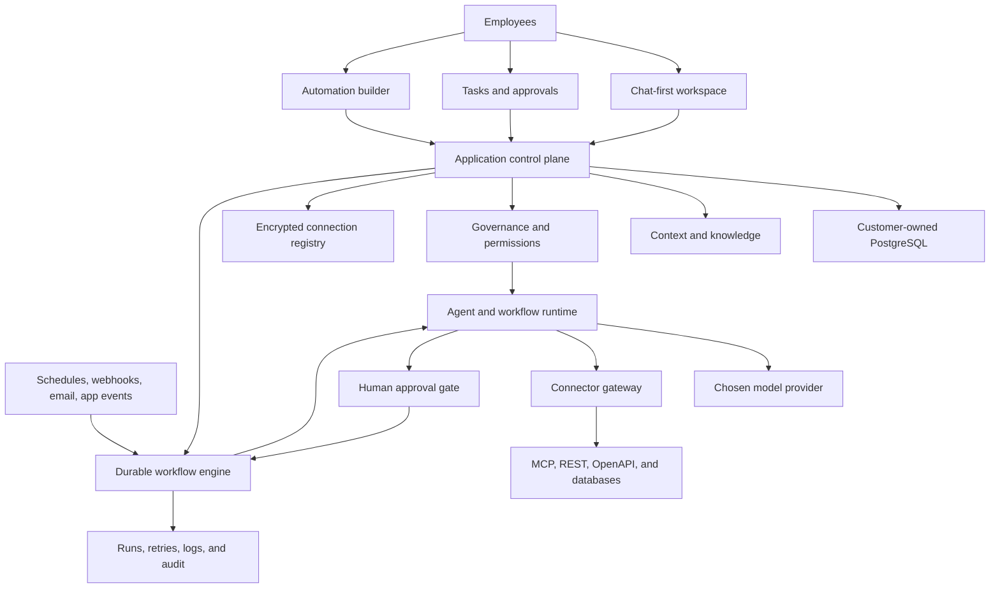

# AI Native Operating System Design

**Status:** Approved for implementation on July 16, 2026
**Repository owner:** [stephenbickel](https://github.com/stephenbickel)
**Repository:** `ai-native-operating-system`

## 1. Product definition

The AI Native Operating System is the governed coordination layer between a company's people, knowledge, workflows, and tools. It gives a team a shared, conversational place to understand the business, delegate work, approve sensitive actions, schedule automations, and see what happened.

Chat is the front door, not the whole product. The product combines a Codex-style team workspace with a durable automation plane, a permissioned connector gateway, organizational memory, human approval gates, and a complete audit trail.

The system is AI-native because company context is agent-readable, repeatable processes are executable skills, permissions are explicit, humans and agents share the same task model, and model or tool providers can change without rewriting the company's operating model.

## 2. Goals

The first public release must:

1. Be a real reference implementation that a technical evaluator can clone, run in mock mode, and inspect end to end.
2. Give a team a deployable, multi-user, chat-first workspace for conversations, tasks, approvals, automations, integrations, and run history.
3. Let customers use their own PostgreSQL database, model API keys, tools, GitHub repository, Vercel account, and local infrastructure.
4. Demonstrate a reusable industry-neutral engine specialized by installable industry packs.
5. Make regulated-industry safety structural through permissions, audit trails, stricter autonomy, and human gates.
6. Sell Stephen Bickel's custom implementation service to a non-technical business owner.

## 3. Non-goals

The reference release will not:

- Replace a client's CRM, EHR, practice-management system, accounting system, or document repository.
- Offer autonomous legal advice, clinical decisions, money movement, destructive database actions, or unsupervised external communications.
- Build a general drag-and-drop integration product comparable to Zapier.
- Promise exactly-once behavior from third-party APIs; it will use idempotency, deduplication, and reconciliation instead.
- Store live client secrets, protected health information, privileged material, or real customer records in the public repository.

## 4. Product surfaces

The interface is chat-first but not chat-only:

- **Chat:** Start work, ask questions, share context, and follow agent execution in real time.
- **Inbox:** Review approvals, failures, escalations, and assignments.
- **Tasks:** Coordinate human and agent work with ownership and lifecycle state.
- **Automations:** Describe, inspect, test, publish, pause, and version scheduled or event-driven processes.
- **Knowledge:** Browse approved company memory, references, lessons, and decisions.
- **Integrations:** Connect tools and databases and set operation-level permissions.
- **Runs:** Inspect step output, retries, timing, cost, approvals, and failures.
- **Admin:** Manage members, roles, model providers, policies, secrets, packs, and deployment settings.

The main workspace uses a three-panel layout: conversation navigation on the left, a streaming chat and composer in the center, and live context on the right. Tool calls and approval requests appear inline as readable cards. The interface uses a quiet, high-contrast visual system inspired by professional developer tools, without copying Codex branding or proprietary assets.

## 5. System architecture



### 5.1 Control plane

The Next.js application owns identities, workspaces, conversations, tasks, approval requests, workflow definitions, connection metadata, current memory, and audit views. Every data-bearing table includes a workspace identifier. Server-side authorization and PostgreSQL Row-Level Security both enforce workspace isolation.

### 5.2 Durable automation plane

Inngest is the default durable workflow engine. It coordinates schedules, event triggers, saved step state, retries, waits, concurrency, throttling, and human approval pauses. The application depends on an internal workflow interface so another durable engine can be introduced without changing product concepts.

Interactive response streaming may begin in a web request, but durable work is handed to the workflow plane before the request ends. Long-running work never depends on an open browser tab or a single Vercel invocation surviving indefinitely.

### 5.3 Agent runtime

The agent runtime assembles the active core contract, installed pack, company context, relevant memories, skill instructions, user request, and allowed tools. It invokes the configured model and validates structured outputs before taking any action.

AI reasoning is used for ambiguous steps such as classification, extraction, summarization, drafting, and choosing among explicitly allowed branches. Deterministic code handles scheduling, filtering, API calls, state transitions, permission checks, retries, and audit records.

### 5.4 Connector gateway

The gateway supports five connector classes:

1. Remote HTTP-based MCP servers, suitable for Vercel and local deployments.
2. Local `stdio` MCP servers, available to local or private workers.
3. REST and OpenAPI connectors with explicit operation schemas.
4. PostgreSQL data connectors with schema, table, statement, and access-mode allowlists.
5. Built-in typed adapters for the polished demo integrations.

Every exposed operation declares its read/write effects, allowed skills, autonomy requirement, approval rule, credential source, data boundary, redaction behavior, timeout, and retry policy. The runtime enforces these declarations independently of model output.

### 5.5 Event gateway

Automations may start from chat, a recurring schedule, a one-time schedule, a webhook, a connected-tool event, a task transition, a database event, or another workflow. Inputs are normalized into an event envelope containing event ID, workspace ID, source, type, occurrence time, receipt time, payload reference, schema version, and idempotency key.

### 5.6 Human approval

Approval is a durable workflow state. Each request records the proposed action, reason, source data, expected effect, risk, required approvers, expiration, escalation behavior, and decision. Rejection is final for that proposed tool call unless a human explicitly requests a revised draft.

## 6. Engine and industry packs

The repository keeps the original two-layer operating model.

### 6.1 `core/`: reusable engine

`core/` contains only industry-neutral contracts for agents, memory, skills, tasks, governance, integrations, automations, and audit behavior. The hard boundary is:

> Nothing company-specific or industry-specific may exist inside `core/`.

A repository validator scans the core for known demo-company and regulated-industry terms. Any exception must be a generic worked-example marker in governance documentation and must not contain operational data.

### 6.2 `packs/`: industry overlays

A pack adds terminology, governance restrictions, skills, integration recipes, seed memories, and company defaults without modifying core. Overlay precedence is additive and restrictive:

```text
core baseline → industry pack → company policy → task-specific restriction
```

A later layer may tighten permissions but may never weaken an earlier layer. The effective autonomy tier is always the strictest applicable tier.

The reference repository includes:

- A fully built marketing-agency pack instantiated for the fictional 12-person agency Meridian Creative.
- A law-firm pack with finished intake, matter-status, and engagement-letter skills plus privilege and confidentiality controls.
- A healthcare-practice pack with finished intake, referral, and prior-authorization skills plus PHI boundaries and human-send rules.

## 7. Data ownership and storage

Different data belongs in different systems:

| System | Owns |
|---|---|
| Customer PostgreSQL | Users, memberships, chats, tasks, workflow definitions, runs, approvals, connections, current memories, and audit events |
| Customer Git repository | Core and pack definitions, approved policy, skill templates, workflow exports, durable-memory exports, configuration history, and public reference content |
| Customer business tools | Authoritative CRM, finance, legal, clinical, project, commerce, communication, and operational records |
| Object storage | User attachments and large generated artifacts through local or S3-compatible adapters |

Git is a versioned operating contract and export target, not the transactional database for live chat. Approved memories and workflow versions can be committed back to Git through an explicit human-controlled synchronization action.

## 8. Authentication, tenancy, and secrets

Better Auth provides sessions, PostgreSQL persistence, organizations, invitations, members, and roles. The initial roles are owner, admin, member, and viewer. Tool permissions and approval authority are separate from navigation roles so a member can be allowed to approve a content draft without being allowed to manage integrations.

Production secrets never reach the browser or Git history. A deployment-level `ENCRYPTION_KEY` encrypts workspace connector secrets at rest. A company may instead provide secrets entirely through deployment environment variables. Logs store credential references and redacted request metadata, never raw secret values.

The default model credential is a deployment-owned `OPENAI_API_KEY`. The model-provider interface also permits Azure OpenAI, Anthropic, Google, OpenAI-compatible endpoints, and local providers such as Ollama or vLLM.

## 9. Deployment profiles

### 9.1 Local evaluation

`docker compose up` starts the web application, PostgreSQL, the workflow engine, and a worker. Seeded Meridian users, conversations, tasks, memories, workflows, and mock connectors make the product usable without third-party secrets. A deterministic mock model produces stable demo responses.

### 9.2 Customer-owned Vercel

The customer deploys the Next.js app to its Vercel account, supplies a hosted PostgreSQL connection, selects managed or separately hosted workflow coordination, and configures remote MCP or REST integrations. Server-side environment variables hold deployment credentials.

### 9.3 Private or hybrid hosting

The application and worker can run as containers on customer infrastructure. A hybrid installation may keep the shared interface on Vercel while a private worker connects outbound to the workflow engine and accesses internal systems. Local `stdio` MCP connectors run only on local or private workers, never inside the browser.

## 10. Automation authoring and lifecycle

A user can describe an automation in natural language. The system creates a typed draft containing trigger, inputs, deterministic steps, agent steps, tool permissions, approval gates, retry policy, concurrency policy, outputs, and owners. The user can inspect the readable step list before publishing.

The lifecycle is:

```text
draft → validate → dry run → approval → published → active
                                             ↓
                              paused ← versioned → retired
```

Published versions are immutable. Editing creates a new draft version. Every run points to the exact workflow, pack, skill, policy, model, and connector versions used.

## 11. Failure and safety behavior

The system fails closed:

- Missing permission denies a tool call.
- Missing or invalid credentials produce an actionable connection error.
- Invalid model output is rejected before execution.
- A timed-out read may retry according to policy; a write retries only with an idempotency key or confirmed safe reconciliation behavior.
- An expired approval follows the configured escalation rule and never silently approves itself.
- A connector returning unexpected data is quarantined from downstream writes.
- Pack parse or policy-overlay failures prevent the affected workflow from starting.
- Every partial failure remains visible in the run timeline with a safe retry or manual-resolution path.

## 12. Reference implementation scope

The Meridian demo includes working mock implementations of Slack, HubSpot, Notion, Google Calendar, Gmail, and Stripe. It demonstrates lead intake, client onboarding, weekly status reporting, content pipeline management, invoice chasing, and meeting debriefs.

At least two automations run end to end in mock mode:

1. A weekday lead-response workflow reads mock HubSpot leads, identifies stale contacts, drafts Gmail follow-ups, requests account-owner approval, records approved sends, and updates the CRM fixture.
2. A daily agency digest aggregates mock Slack, calendar, task, pipeline, and invoice activity into a shared report and an auditable run.

Law and healthcare connectors remain non-secret sketches, but their governance overlays and finished skills are parsed and tested by the same runtime used for marketing.

## 13. Repository structure

```text
.
├── README.md                         # Client-facing front door and deployment CTA
├── AGENTS.md                         # Meridian-instantiated agent contract
├── MEMORY.md                         # Active memory index
├── TASKS.md                          # Seeded current-sprint view
├── CHANGELOG.md                      # Append-only agent session record
├── LICENSE                           # MIT license
├── Makefile                          # Setup, demo, validation, and test commands
├── package.json                      # Workspace scripts and pinned package manager
├── pnpm-workspace.yaml               # Monorepo package boundaries
├── docker-compose.yml                # Complete local deployment
├── .env.example                      # Documented deployment variables
├── .mcp.example.json                 # Secret-free connector example
├── apps/
│   └── web/                          # Next.js chat-first control plane
│       ├── README.md
│       ├── app/                      # Public, auth, workspace, admin, and API routes
│       ├── components/               # Chat, task, automation, run, and settings UI
│       ├── lib/                      # Server composition and authorization
│       ├── public/                   # Brand-safe static assets
│       └── tests/                    # Web unit and integration tests
├── packages/
│   ├── agent-runtime/                # Context assembly and model execution
│   ├── auth/                         # Better Auth and workspace roles
│   ├── db/                           # PostgreSQL schema, queries, and migrations
│   ├── model-providers/              # Mock, OpenAI, and provider contracts
│   ├── operating-system/             # Core and pack parsing and overlay logic
│   ├── storage/                      # Local and S3-compatible storage
│   ├── tool-runtime/                 # MCP, REST, database, and mock connectors
│   ├── ui/                           # Shared design tokens and primitives
│   └── workflow-runtime/             # Durable workflow abstraction and Inngest adapter
├── core/                             # Industry-neutral operating contracts
│   ├── AGENTS.template.md
│   ├── SYSTEM.md
│   ├── GOVERNANCE.md
│   ├── memory/
│   ├── skills/
│   ├── integrations/
│   ├── automations/
│   └── tasks/
├── packs/
│   ├── README.md                     # Pack model and industry catalog
│   ├── marketing-agency/             # Full Meridian implementation
│   ├── law-firm/                     # Regulated legal overlay
│   └── healthcare-practice/          # Regulated healthcare overlay
├── deployment/
│   ├── local/                        # Docker and local MCP guidance
│   ├── vercel/                       # Customer-owned Vercel deployment
│   └── private/                      # Container and hybrid-worker guidance
├── docs/
│   ├── HOW-ITS-BUILT.md
│   ├── ENGAGEMENT.md
│   ├── FAQ.md
│   └── superpowers/                  # Approved design and implementation plan
├── scripts/                          # Setup, seed, demo, and repository validators
└── .github/
    ├── ISSUE_TEMPLATE/               # Task, idea, and bug forms
    └── workflows/                    # Validation, digest, memory, and triage automation
```

Every authored directory contains a README defining what agents and humans may read or write there. Skill directories also include a `SKILL.md`; integration directories document reads, writes, callers, setup, permissions, mock behavior, and failure policy.

## 14. Quality strategy

Verification covers four levels:

1. **Contract tests:** Core contains no company data; packs only tighten governance; memories and skills satisfy their schemas; every directory has a README.
2. **Unit tests:** Event normalization, permission resolution, overlay precedence, model-output validation, idempotency, and connector redaction.
3. **Integration tests:** PostgreSQL workspace isolation, authentication, chat persistence, workflow state, approval resume, Git export, and mock connector behavior.
4. **Browser tests:** Sign in, open seeded workspace, send a chat request, observe a streamed run, approve a tool call, create an automation draft, execute a dry run, and inspect its audit trail.

Required completion commands are `pnpm lint`, `pnpm typecheck`, `pnpm test`, `pnpm test:e2e`, `pnpm build`, `make validate`, and `make demo`. The implementation may not claim success unless fresh output shows all commands passing.

## 15. Commit story

The repository will use eight logical commits:

1. Record the approved product design.
2. Define the industry-neutral core and pack contracts.
3. Build the portable database, auth, and operating-system packages.
4. Add the workflow, model, and connector runtimes.
5. Build the chat-first multi-user web application.
6. Add the full Meridian marketing pack and working mock automations.
7. Add law and healthcare packs plus client-facing collateral.
8. Add deployment profiles, GitHub automation, verification, and final polish.

The final handoff includes the exact command `gh repo create stephenbickel/ai-native-operating-system --public --source=. --remote=origin --push` after local verification.

## 16. Acceptance criteria

The design is implemented when a fresh clone can:

1. Start locally from documented commands without proprietary infrastructure.
2. Open a seeded Meridian workspace and use the chat-first interface in deterministic mock mode.
3. Run and inspect the two reference automations, including a durable human approval pause.
4. Connect a customer-owned PostgreSQL database and choose mock or OpenAI model execution through environment configuration.
5. Register a remote MCP, REST/OpenAPI, or restricted PostgreSQL tool through the documented connector contract.
6. Demonstrate workspace isolation, operation-level permissions, audit records, and stricter regulated-industry overlays through automated tests.
7. Deploy the web app to a customer-owned Vercel account or run the full system locally through Docker.
8. Present the service clearly to a business owner while giving a technical evaluator enough evidence to trust the architecture.
